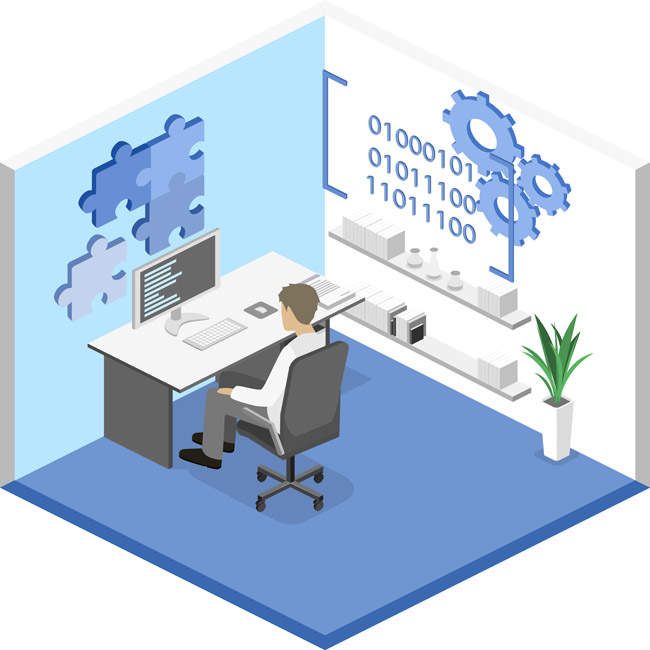

My first time contact with Computer Science was during my last year of high school. By chance, my friend recommended me to take an AP course called "Computer Science Principles" with him, and that’s my first contact and understanding of programming and code. As well as the first programming language I was taught, JavaScript, though learning, I gradually went from knowing nothing to having a little basic knowledge of programming, while enjoying the feeling of happiness and accomplishment brought by the successful running of code, until the end of my high school. Because of the novel experience brought by computer courses, I firmly choose computer science as my major in college, and hope to learn and improve more of my programming experience in college courses.

## Interest in Software Engineering

Until now, I have been exposed to some programming languages such as C, C++, Java, JavaScript and so on, which also makes me very interested in software engineering, and I really enjoy the feeling of happiness and accomplishment when my code is completed and run correctly. Write the code line by line with your own hands and solve the problem step by step.

## Future

I hope that by taking this course in software engineering, I can fully understand the theoretical knowledge, coding tools, and processes that must be mastered to develop a software, and get practice and familiarity with it.

At the same time, I also hope to become better at the programming languages I have learned in the past or will be in the future, gain more experience in the field of computer science, develop many projects independently, and improve my ability, such as improving my problem-solving, coding knowledge, understanding of the question and so on.

## In Conclusion

I expect and hope to learn and know something useful when I get out of college.
