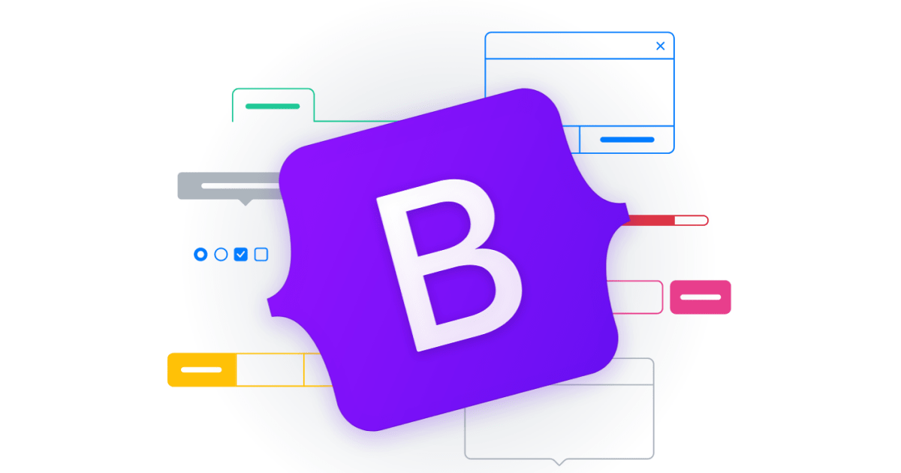

## Introduction
After a few weeks of contact with Bootstrap 5, HTML, and CSS, I have some knowledge and understanding of them. I believe that HTML, CSS, and UI Frameworks are some of the basic tools for web development to create web pages and define the style of web pages, including the design, layout, and display changes of different devices and screen sizes.

## The Convenience of Bootstrap 5
A good web page needs to have strong attraction and function, and using HTML and CSS to make a good website takes a lot of time to modify and check, which is very complex, cumbersome, and challenging.
However, Bootstrap 5 shortens this process. Bootstrap 5 has great advantages in terms of responsive web design, compatibility of different web pages, and design complexity. Through the pre-prepared framework, the process of creating a web page is simpler and more convenient, while maintaining a consistent web outlook and feel, which is easier to maintain and update the web page.

## Disadvantages
The difficulty of learning Bootstrap 5 depends on your programming background, development experience, learning quality, and many other factors, you need to invest a lot of time to learn and practice a large number of classes and components that Bootstrap 5 provides.
At the same time because of the use of the same framework, it may also lead to many web pages with similar appearance and lack of uniqueness.

## Conclusion
It is inevitable that the UI framework is really a powerful tool in web development, providing a standard and simplified process to create a good web page, and is of great help to the effectiveness and consistency of the web page.
