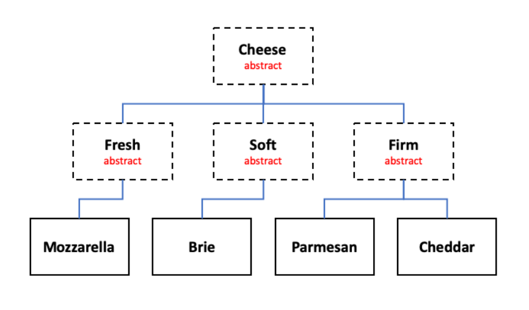

ManoaCheeseFromager function was part of my second assignment in the ICS 211, spring 2022, by completing this assignment, it helped me continue to study, practice, and learn about the Java programming language like Class Hierarchies and Interfaces.

this function enhanced my understanding of OOP, class hierarchies, and interfaces by creating a simple Java class hierarchy of Cheese and a Fromager.

makes me get more familiar with class hierarchies, abstracts, and how to use Eclipse.

