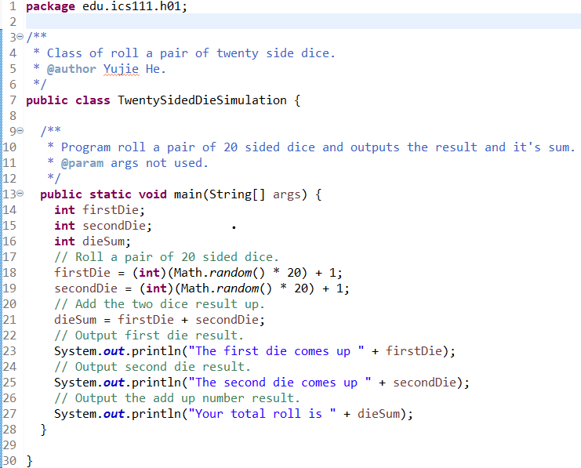

TwentySideDieSimulation was part of my first assignment in the ICS 111, Fall 2021, it helped me get started and learn the Java programming language.

The class rolls a pair of 20 sided dice, it will get two integers at random within the specified range by using Math.random(), and returns the result by adding the two numbers together.

From this assignment, I have learned how to create variables and use Math.random() in Java.

