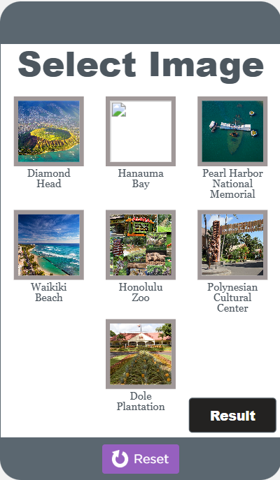

Hawaii-Oahu Travel Brochure program is a Create Performance Task of AP Computer Science Principles in my high school. In programming, we create and run codes by using code.org. This program helps me test my knowledge and understanding of JavaScript.

The program will recommend the famous tourist places in Oahu to the user. The user can click on the pictures of the places to see the detailed introduction and decide whether he likes or dislikes them. According to the different choices, the interface will change, and the program will finally display the places the user likes and dislikes separately.

This program helps me test and practice my JavaScript programming skills, independent creativity, problem-solving, etc.

