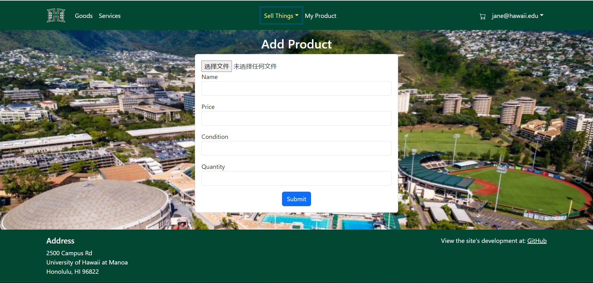
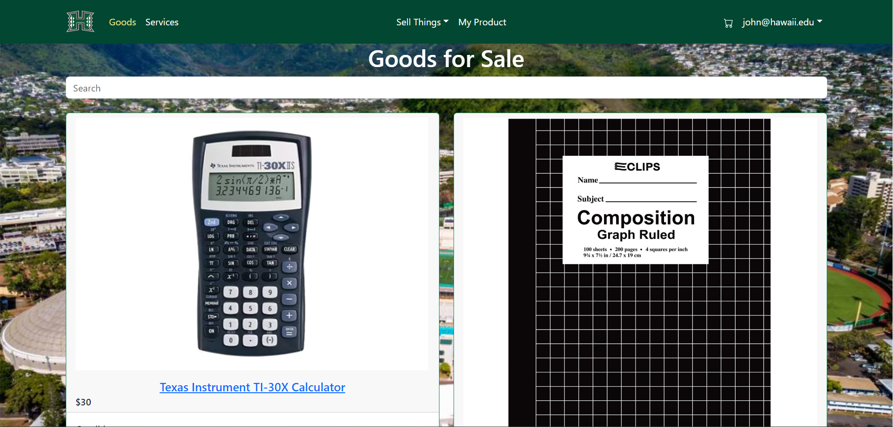

  
  
  

## Introduction

Manoa MarketPlace is my final project for ICS314, I was working with 4 groupmate, Andrew Lin, Baishen Wang, BingYing Li, Carlton Hung. The main purpose of the app is to provide an efficient marketplace to help UHM students recycle and reuse a large number of "campus specific" goods and services more efficiently, buying and selling goods and services they do not need.

In this Web application, I am responsible for implementing certain functions, such as implementing add product page, show my product page, add service page, image upload function, and etc. Besides, other team members are responsible for other functions such as implementing the home page, sign in page, sign up page, and log-out page, delete item function, add cart function, check-out cart function, etc. check out [Manoa Marketplace](https://manoa-market-place.github.io/) for more information.

